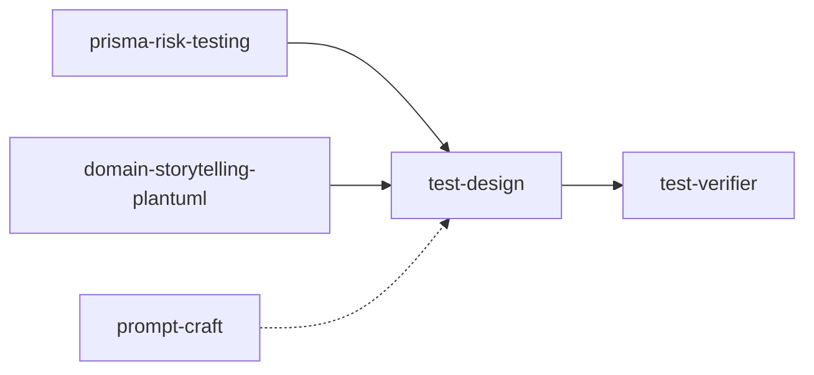

# skills-testing-qa

Coleção de **Agent Skills** voltadas para QA e testing, pensadas para uso no Cursor (e
compatíveis com outros agentes que suportam o formato `SKILL.md`). Cada skill ensina o
agente a executar um fluxo de teste específico — projetar casos, verificar suítes,
priorizar por risco, modelar domínio e construir prompts — sem depender de improviso.

## Sumário

- [Pré-requisitos](#pré-requisitos)
- [Como instalar as skills](#como-instalar-as-skills)
- [Como usar no chat](#como-usar-no-chat)
- [Fluxo QA recomendado](#fluxo-qa-recomendado)
- [Catálogo de skills](#catálogo-de-skills)
- [Skills em desenvolvimento](#skills-em-desenvolvimento)
- [Estrutura do repositório](#estrutura-do-repositório)
- [Contribuir](#contribuir)

## Pré-requisitos

- Cursor com suporte a Agent Skills (ou outro agente que leia `SKILL.md`).
- Opcional: servidores MCP para integrações (ClickUp, GitLab, Figma, etc.). As notas de
  configuração ficam em [`mcps/readme.md`](mcps/readme.md) (ainda um stub).

## Como instalar as skills

As skills moram em [`skills/`](skills/) na raiz do repositório. O Cursor descobre skills
em `.cursor/skills/` (projeto) ou `~/.cursor/skills/` (pessoal), então aponte uma dessas
pastas para as skills deste repo. Symlink é preferível a cópia, pois mantém tudo
versionado em um único lugar.

### Opção A — Projeto (recomendado para este repo)

Disponibiliza as skills apenas para quem abrir este projeto:

```bash
mkdir -p .cursor/skills
for skill in test-design test-verifier prisma-risk-testing domain-storytelling-plantuml prompt-craft; do
  ln -s "$(pwd)/skills/$skill" ".cursor/skills/$skill"
done
```

### Opção B — Pessoal (todos os seus projetos)

Disponibiliza as skills em qualquer projeto que você abrir no Cursor:

```bash
mkdir -p ~/.cursor/skills
ln -s "$(pwd)/skills/test-design" ~/.cursor/skills/test-design
# repita para as demais skills desejadas
```

Depois de criar os links, reinicie o chat do Cursor para que ele recarregue a lista de
skills.

## Como usar no chat

1. **Mencione a skill** com `@` (por exemplo, `@test-design`) para forçar o uso dela.
2. Ou **use gatilhos em linguagem natural** — cada skill declara seus disparadores no
   campo `description` do frontmatter (ex.: "criar testes", "matriz de risco",
   "domain story", "me ajuda a fazer um prompt"). O agente seleciona a skill sozinho.
3. **Forneça o contexto mínimo** que a skill pede: a tarefa, o código ou diff sob teste,
   o épico/critérios de aceite, etc.

## Fluxo QA recomendado

As skills se encaixam em um fluxo de QA, da priorização à validação final:



Ordem sugerida:

1. **prisma-risk-testing** — priorizar o que testar primeiro quando tempo e recursos são
   limitados.
2. **domain-storytelling-plantuml** — alinhar processo e domínio quando o requisito é
   ambíguo ou novo.
3. **test-design** — derivar os casos e escrever os testes.
4. **test-verifier** — gate de qualidade antes de declarar a tarefa pronta.
5. **prompt-craft** — transversal; útil sempre que precisar montar um prompt reutilizável.

## Catálogo de skills

### test-design

[`skills/test-design/SKILL.md`](skills/test-design/SKILL.md)

- **O que faz:** projeta quais casos de teste escrever olhando para o código e os
  implementa em Arrange-Act-Assert estrito, escolhendo a técnica adequada a cada formato
  de código.
- **Quando usar:** "escrever/criar testes", "cobrir essa função/componente", "casos de
  teste", "cobertura", "TDD", "test design" — na fase QA do fluxo dev.
- **Escopo:** testes unitários e integrados de componente. **Não** cobre API/contrato,
  sistema, E2E, carga ou performance.
- **Técnicas:** boundary value, equivalence class, decision table, state-transition,
  pairwise, domain analysis, control flow, data flow, MC/DC.
- **Entrada:** tarefa + código alterado/sob teste (roda a suíte existente primeiro).
- **Saída:** plano de casos derivados + testes escritos e passando.
- **Exemplo:** `@test-design Preciso cobrir a função validateAge no diff aberto`
- **Asset:** [`assets/test-plan-template.md`](skills/test-design/assets/test-plan-template.md)

### test-verifier

[`skills/test-verifier/SKILL.md`](skills/test-verifier/SKILL.md)

- **O que faz:** verifica uma suíte de testes já escrita e emite um veredito —
  **APROVADO** ou **BLOQUEADO** — com itens acionáveis quando bloqueia. Complementa a
  `test-design`; não projeta casos.
- **Quando usar:** "verificar/validar testes", "revisar a suíte", "gate de testes",
  "esses testes seguem o padrão?", "essa suíte pode liberar?".
- **Frentes:** padrão AAA + qualidade ISO 25010 (no que é verificável em nível
  unitário/componente).
- **Entrada:** tarefa + diff + testes correspondentes.
- **Saída:** veredito com violações de AAA e características de qualidade cobertas/delegadas.
- **Exemplo:** `@test-verifier Os testes do MR estão prontos para merge?`

### prisma-risk-testing

[`skills/prisma-risk-testing/SKILL.md`](skills/prisma-risk-testing/SKILL.md)

- **O que faz:** conduz análise de risco de produto pelo método PRISMA (impacto ×
  probabilidade de defeito), gerando matriz de risco, classificação em quadrantes e
  abordagem de teste diferenciada por prioridade.
- **Quando usar:** "matriz de risco", "teste baseado em risco", "priorizar testes",
  "must test", "squeeze", "good enough testing", "o que testar primeiro com pouco tempo".
- **Modos:** planejamento completo, rápido/solo QA, revisão pós-defeitos, integração
  upstream e squeeze (release iminente).
- **Saída:** relatório em `output/prisma/[slug]-[YYYYMMDD].md` (CSV opcional).
- **Guia rápido:** [`skills/prisma-risk-testing/GUIA-USO.md`](skills/prisma-risk-testing/GUIA-USO.md)
- **Exemplo:** `@prisma-risk-testing Tenho 2 semanas para testar o fluxo de PIX`

### domain-storytelling-plantuml

[`skills/domain-storytelling-plantuml/SKILL.md`](skills/domain-storytelling-plantuml/SKILL.md)

- **O que faz:** facilita um Domain Storytelling em PT-BR (entrevista estruturada) e
  gera a história narrada mais o código PlantUML com a biblioteca DomainStory — um
  artefato versionável que explica o fluxo da especificação.
- **Quando usar:** "domain story", "storytelling de domínio", "história de domínio",
  "diagrama de processo com atores e objetos", "refinamento DDD com narrativa visual".
- **Particularidade:** obriga a escolha do nível de granularidade (grossa, pura, fina,
  digitalizada) antes de gerar o diagrama.
- **Saída:** narrativa em PT-BR + arquivo `.puml` reproduzível.
- **Exemplo:** `@domain-storytelling-plantuml Quero modelar o processo de checkout AS-IS`

### prompt-craft

[`skills/prompt-craft/SKILL.md`](skills/prompt-craft/SKILL.md)

- **O que faz:** conduz uma entrevista estruturada, escolhe a melhor técnica de prompting
  e entrega o prompt final otimizado, pronto para colar em qualquer LLM.
- **Quando usar:** "criar um prompt", "melhorar este prompt", "me ajuda a fazer um
  prompt", "qual o melhor prompt para…".
- **Fases:** entrevista → resumo para confirmação → seleção de técnica → geração do
  prompt final.
- **Catálogo:** 23 técnicas (Zero-Shot, Few-Shot, CoT, ReAct, PEPE, CARE, etc.) em
  [`references/`](skills/prompt-craft/references/).
- **Exemplo:** `@prompt-craft Preciso de um prompt para gerar casos de teste E2E`

## Skills em desenvolvimento

Pastas que contêm apenas notas ou placeholders (`.gitkeep`), ainda sem `SKILL.md`:

| Skill | Intenção |
|-------|----------|
| `write-test-case` | Escrever o caso de teste seguindo template via ditado. |
| `refinament` | Heurísticas para entender a story e gerar perguntas com base no contexto de produto. |
| `figma-context` | Ler o Figma da atividade para contextualizar o projeto. |
| `owasp-context` | Contexto de segurança baseado em OWASP / OWASP GenAI. |
| `clickup-task-context` | Trazer contexto de tarefas do ClickUp. |
| `jira-task-context` | Trazer contexto de tarefas do Jira. |
| `design-pattner` | Padrões de automação (Page Objects, Screenplay, OD-DP). |
| `test-heuristic` | Heurísticas de teste exploratório. |
| `framework-context` | Contexto de frameworks (web, API, mobile). |
| `strategy-testing-context` | Estratégias (pirâmide, troféu, quadrantes ágeis). |
| `setup` | Preparar a máquina/ambiente (ex.: Appium, chaves de API). |
| `bug-traking` | Apoio ao registro e rastreio de bugs. |
| `teams-context` / `slack-context` | Contexto de comunicação do time. |

## Estrutura do repositório

```
skills/      # skills de QA (SKILL.md + references/ + examples/ + assets/)
templates/   # templates de test plan, Gherkin e casos de teste
mcps/        # notas de configuração de MCP (stub)
output/      # artefatos gerados pelas skills (ex.: prisma/) — criado em runtime
```

## Contribuir

- **Nova skill:** crie `skills/<nome>/SKILL.md` com frontmatter (`name`, `description`)
  e, quando útil, subpastas `references/`, `examples/` e `assets/`.
- **Descrição:** mantenha o `description` do frontmatter com gatilhos claros — é o que
  faz o agente selecionar a skill no momento certo.
- **Idioma:** as skills atuais operam em PT-BR (algumas também em inglês); mantenha a
  consistência com a skill que estiver editando.
