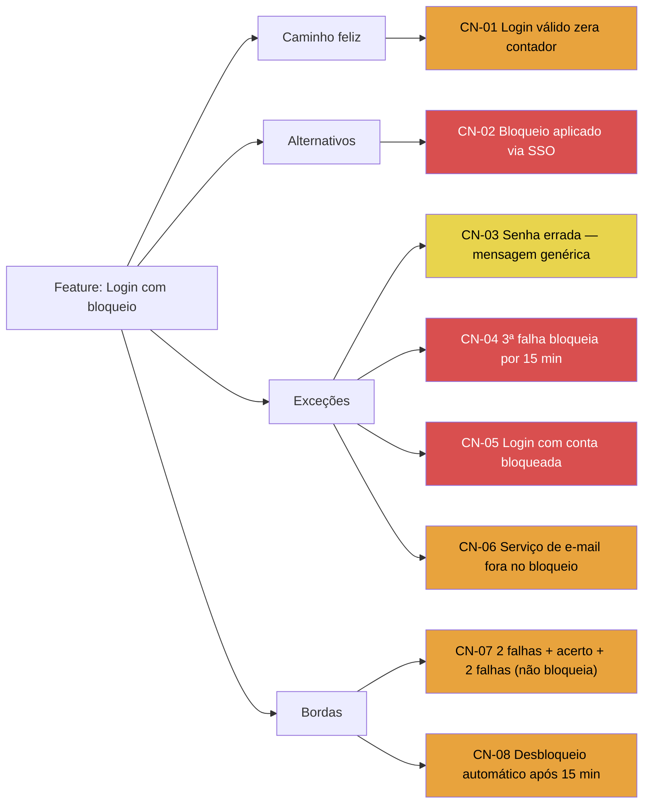

# Exemplo — Árvore de cenários de teste

Mesma feature fictícia do outro exemplo: **login com bloqueio após 3 tentativas**. Modo usado: **reunião ao vivo**.

## Entrada do usuário (anotações durante o refinamento)

```
bloqueio depois de 3 senhas erradas seguidas
mensagem de erro tem que ser genérica, não dizer se é email ou senha
contador zera quando loga certo
vale pra SSO também — isso é decisão
15 min de bloqueio, depois libera sozinho
manda email de aviso pelo serviço de notificações
e se o serviço de email tiver fora? — isso é dúvida
Maria vai confirmar com o time de segurança se bloqueia por IP também
mostra o fluxo          ← prévia parcial gerada aqui
fechar
```

## Saída gerada (`output/test-flow-mapping/login-bloqueio-20250714.md`)

---

# Mapa de testes — Login com bloqueio após 3 tentativas

## Contexto e modo utilizado

- **Modo:** reunião ao vivo
- **Tipo de diagrama:** árvore de cenários de teste
- **Fonte da criticidade:** mini-scoring com assumptions
- **Data:** 2025-07-14
- Refinamento da story de bloqueio de conta após 3 falhas de login; discussão cobriu regra do contador, SSO, desbloqueio automático e aviso por e-mail.

## Fluxograma



🟥 Q I Must Test · 🟧 Q II Should Test · 🟨 Q III Could Test · ⬜ Q IV Won't Test

## Cenários mapeados

| ID | Cenário | Tipo | Criticidade |
|----|---------|------|-------------|
| CN-01 | Login válido zera o contador de falhas | feliz | Q II |
| CN-02 | Bloqueio aplicado também via SSO | alternativo | Q I |
| CN-03 | Senha errada exibe mensagem genérica (sem revelar campo) | exceção | Q III |
| CN-04 | 3ª falha consecutiva bloqueia por 15 min | exceção | Q I |
| CN-05 | Tentativa de login com conta já bloqueada | exceção | Q I |
| CN-06 | Serviço de e-mail fora no momento do bloqueio | exceção | Q II |
| CN-07 | 2 falhas + acerto + 2 falhas não bloqueia | borda | Q II |
| CN-08 | Desbloqueio automático após 15 min | borda | Q II |

## Perguntas em aberto

- [ ] O que acontece se o serviço de e-mail estiver fora quando o bloqueio dispara? (dúvida anotada na reunião)
- [ ] Bloqueio também por IP? (Maria vai confirmar com segurança)

## Ata resumida da discussão

**Pontos discutidos:**
- Regra do contador de falhas consecutivas e reset em login com sucesso.
- Mensagem de erro genérica por segurança.
- Duração e desbloqueio automático (15 min).
- Aviso por e-mail via serviço de notificações.

**Decisões do time:**
- Bloqueio vale também para SSO.

**Responsáveis citados:**
- Maria — confirmar com time de segurança se haverá bloqueio por IP.

## Premissas assumidas

- CN-02/CN-04/CN-05 marcados Q I assumindo alto impacto de falha de segurança/acesso e código novo.

## Próximos passos sugeridos

- Aguardar retorno da Maria antes de fechar escopo de bloqueio por IP.
- Usar CN-01..CN-08 como entrada da skill `test-design` / `write-test-case`.
