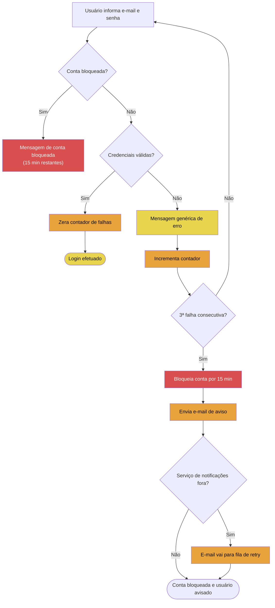

# Exemplo — Fluxo funcional com pontos de teste

Feature fictícia: **login com bloqueio após 3 tentativas**. Modo usado: **texto pronto** (story colada).

## Entrada do usuário

> Story: Como usuário, quero fazer login com e-mail e senha. Se errar a senha 3 vezes seguidas, a conta é bloqueada por 15 minutos e recebo um e-mail de aviso.
> ACs: senha errada mostra mensagem genérica; contador zera em login com sucesso; bloqueio vale também para SSO; e-mail de aviso é enviado via serviço de notificações.

Lacuna crítica perguntada pela skill: *"O que acontece se o serviço de notificações estiver fora quando o bloqueio dispara?"* → resposta: "o bloqueio acontece mesmo assim, e-mail vai pra fila de retry".

## Saída gerada (`output/test-flow-mapping/login-bloqueio-20250714.md`)

---

# Mapa de testes — Login com bloqueio após 3 tentativas

## Contexto e modo utilizado

- **Modo:** texto pronto
- **Tipo de diagrama:** fluxo funcional com pontos de teste
- **Fonte da criticidade:** mini-scoring com assumptions
- **Data:** 2025-07-14
- Login por e-mail/senha com bloqueio temporário (15 min) após 3 falhas consecutivas, aviso por e-mail via serviço de notificações e regra estendida ao SSO.

## Fluxograma

🟥 Q I Must Test · 🟧 Q II Should Test · 🟨 Q III Could Test · ⬜ Q IV Won't Test

## Cenários mapeados

| ID | Cenário | Tipo | Criticidade |
|----|---------|------|-------------|
| CN-01 | Login com credenciais válidas | feliz | Q III |
| CN-02 | Senha errada 1x e 2x — mensagem genérica, contador incrementa | exceção | Q III |
| CN-03 | 3ª falha consecutiva — conta bloqueia por 15 min | exceção | Q I |
| CN-04 | Tentativa de login com conta já bloqueada | exceção | Q I |
| CN-05 | Login com sucesso zera o contador (2 falhas + acerto + 2 falhas ≠ bloqueio) | borda | Q II |
| CN-06 | Bloqueio se aplica também via SSO | alternativo | Q I |
| CN-07 | Serviço de notificações fora — bloqueio ocorre e e-mail vai para retry | exceção | Q II |
| CN-08 | Desbloqueio automático após 15 min | borda | Q II |

## Perguntas em aberto

- [ ] O contador de falhas é por conta ou por conta+dispositivo/IP?
- [ ] O bloqueio derruba sessões ativas existentes?
- [ ] Existe limite de reenvio na fila de retry do e-mail?

## Premissas assumidas

- CN-03/CN-04 marcados Q I assumindo que bloqueio indevido (ou não-bloqueio) afeta segurança e acesso ao produto.
- CN-06 marcado Q I por ser integração nova entre bloqueio e SSO (probabilidade alta de defeito).

## Próximos passos sugeridos

- Rodar `prisma-risk-testing` se a release for crítica.
- Usar CN-01..CN-08 como entrada da skill `test-design`.
