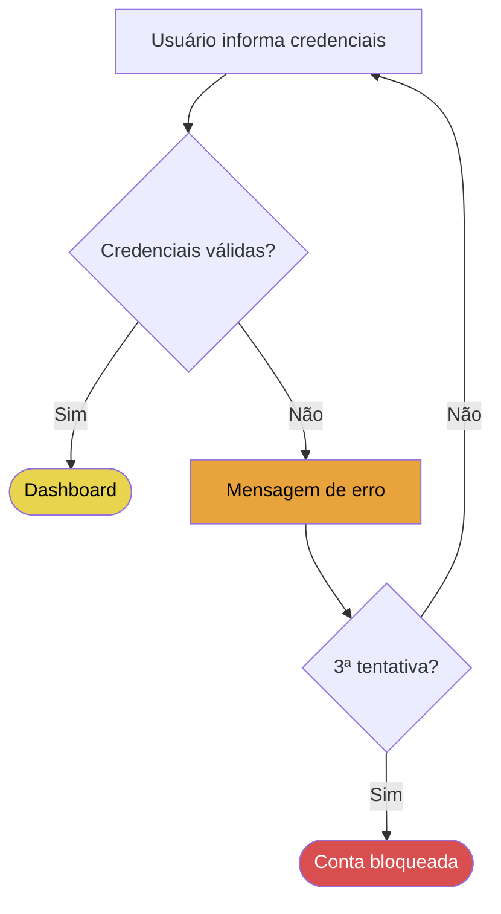
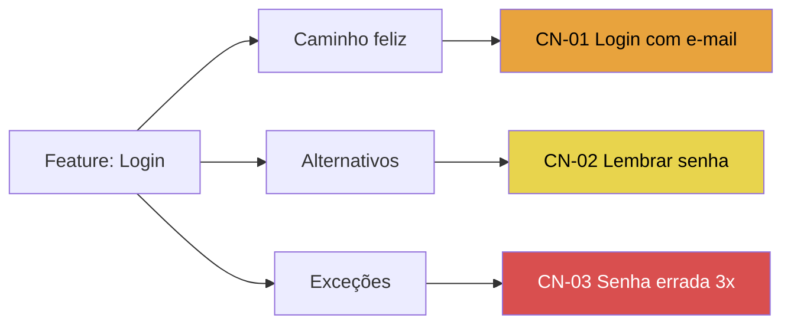

# Convenções Mermaid da Skill

## Orientação por tipo de diagrama

| Tipo | Declaração | Motivo |
|------|-----------|--------|
| Fluxo funcional com pontos de teste | `flowchart TD` | leitura de cima para baixo acompanha a sequência de passos |
| Árvore de cenários de teste | `flowchart LR` | ramificação lateral lê melhor como mapa mental |

## Formas dos nós

| Elemento | Sintaxe | Uso |
|----------|---------|-----|
| Passo/ação | `A[Texto]` | passo do usuário ou do sistema |
| Decisão | `B{Pergunta?}` | validação, condição, escolha |
| Estado final | `C([Texto])` | sucesso, erro, cancelado |
| Ponto de teste destacado | qualquer forma + `:::classe` de criticidade | onde precisa de teste |
| Agrupamento por área | `subgraph Nome ... end` | árvore de cenários ou fluxo grande |

## Classes de criticidade (obrigatórias quando houver priorização)

Definir sempre este bloco no final do diagrama (cores dos quadrantes PRISMA — ver `priorizacao-prisma-cores.md`):

```
classDef q1 fill:#d94f4f,color:#fff
classDef q2 fill:#e8a33d,color:#000
classDef q3 fill:#e8d44d,color:#000
classDef q4 fill:#b0b0b0,color:#000
```

Aplicar com `:::q1` no nó ou `class N1,N2 q1` em lote.

**Legenda obrigatória** logo abaixo do bloco mermaid, em texto:

> 🟥 Q I Must Test · 🟧 Q II Should Test · 🟨 Q III Could Test · ⬜ Q IV Won't Test

## Armadilhas de sintaxe (quebram o render)

1. **Caracteres especiais em labels** — parênteses, `/`, `:`, `,`, aspas → envolver o label em aspas duplas: `A["Login (SSO)"]`.
2. **Ids duplicados** — cada nó precisa de id único (`A`, `B1`, `ERR2`…); reutilizar id junta os nós.
3. **Acentos em ids** — acentos só em labels, nunca no id do nó.
4. **`end` minúsculo como id** — palavra reservada; usar `fim` ou `END1`.
5. **Texto em aresta com caractere especial** — usar `-->|"texto"|`.
6. **`classDef` antes de usar `:::`** funciona, mas por convenção declarar as classes no **final** do diagrama.
7. **Quebra de linha em label** — usar `<br>` (não `\n`).

## Limite de tamanho

Máx. **~25–30 nós** por diagrama. Acima disso:

- Fluxo funcional: dividir por etapa do fluxo (um diagrama por macro-etapa, ligados por estados finais/iniciais).
- Árvore de cenários: um diagrama por área/`subgraph` de nível 1.

## Esqueleto mínimo — fluxo funcional



## Esqueleto mínimo — árvore de cenários



Na árvore de cenários, os nós-folha carregam o **ID do cenário** (`CN-01`…) — o mesmo da tabela de cenários do relatório.
